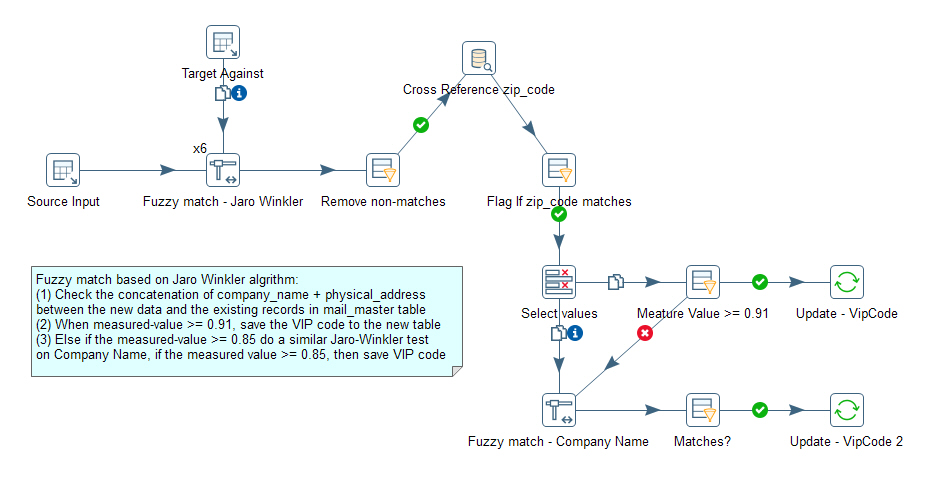

## Data Deduplication Using Fuzzy Match Method ##

Data deduplication is one of the most challenging tasks in data transformation
(cleansing) when the data uniqueness relies on fields which contents could be
randomly entered and error-prone in every aspect. 

There are different approaches in the deduplication of the US mailing addresses.
Two types of methods had been applied in our applications:

1. One is the phonetic method (i.e. using SoundEx, Double-metaphone algorithm etc.)
   to convert the phrase of words into a set of strings based on their spelling.
   The converted strings can serve as a hash key and searching for a match of 
   any new records from the cached hash will be in O(N) order and fast. The downside is that
   the result highly depends on the word alignment, i.e. '13 N' and 'N 13' on the street
   number will mean totally different things, and this method only applies to 
   English language.

2. Comparing the words letter-by-letter and calculate the distance (Levenshtein) or 
   a score(Jaro Winkler) when converting from word-A to word-B. This survives better
   on word/letter dislocation, missing spaces etc. But it takes O(M*N) in comparing
   new addresses against the whole dataset.

The method-2 is less practical when there are 9M+ records to compare against and have all
the work on the same server or maintain the same code/libraries on all related servers.
With Pentaho PDI, this is doable by scale up the transformation (multi-threads parallel computing) 
and then do the standard divide-and-conquer approach to split the dataset into different 
independent groups and run them on a clustered environment (remote execution) w/o maintaining 
the same transformation on different servers.

Below shows the main data flow on the deduplication part:
 

The raw data had been loaded into the MySQL table with pre-processing listed below.
+ remove extra white-spaces
+ lowercase all letters
+ remove all characters that are not in [a-z0-9 ]

Using Pentaho's Jaro Winkler algorithm with the `Fuzzy Match` step: 
1. The uniqueness key is based on `company_name` and `physical_address`
2. Lookup is based on a list of the keys from all records with the same zip_code range
   (for example, all records with zip_code starting with '90')
3. Using Jaro Winkler algorithm, if measured-value >= 0.91 and the 
   zip_code matches exactly, set the record as a dupe
4. Else if the measured-value >= 0.85, do a samilar Jaro-Winkler test
   on `Company Name`, if the measured-value >= 0.85, then set the record as a dupe
5. All other cases will be treated as not a dupe

To scale up the transformation, we can use Pentaho's parallel computing power, and run 4-8
copies (depends on the server resources) of the Steps at the same time:
+ Right-click `Fuzzy match` step and set `Change Number of copies to Start...` to `6`
+ The `Source Input` step (Table Input) need to have Data Movement = 'Round Robin', so the 
  source input is evenly distributed into 6 chunks
+ The `Target Against` step (Table Input) will be the 'Lookup step' and must have 
  Data Movement = 'Copy Data to Next steps'. In such case, each chunk of data from the 
  `Source Input` step receives a full list of data to test against.

**Note**: Fuzzy match step only starts to work after the 'Lookup step' is completed.

This method is more durable and useful than the double-metahone method we applied before.
Meanwhile this approach can both scale up and scale out well to handle the growing dataset. 

