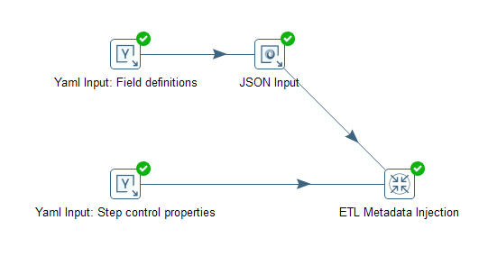
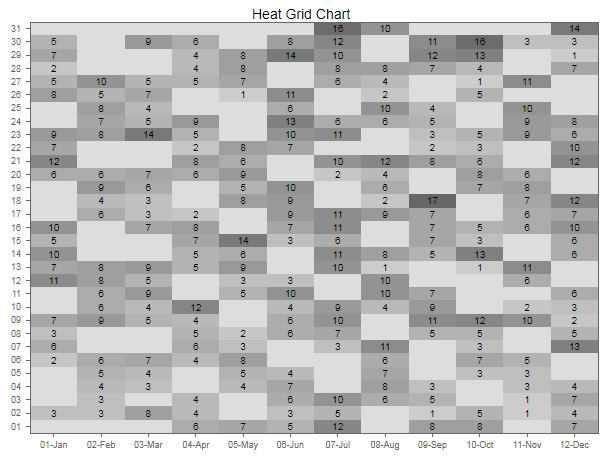

## ETL Metadata Injection: Reuse Transformation templates ##

There are situations when you want to re-use the transformations to handle raw data 
with the same workflow but different field definition, layouts etc. 
For example, to update the a table, you might have raw CSV data from different vendors 
and each of them provides different column names and layout. To reuse your PDI transformation
, you can use the `ETL Metadata Injection` step to setup the fields at run time. 

Below is an example to use YAML files to manage the metadata defining fields and
some step properties. 




### YAML Configuration Files ###

In the step_config.yaml file, all properties are on the same row of the PDI flow. 
In the field_config.yaml file, each field on its own row, `YAML Input` step reader will 
read the data as an array of hashes, so each row is an hash, i.e. '{Name: date, Type: Date,Format: yyyy-MM-dd}'.
The result is feed into the `JSON Input` step and convert into columns using JSONPath.
```
$ cat step_config.yaml
---
csv_field_delimiter: ','
csv_field_enclosed: '"'
csv_escape_char: '"'
csv_cnt_header_lines: 1
csv_cnt_footer_lines: 0
csv_skip_empty_lines: Y
csv_file_format: mixed
csv_file_name: '${Internal.Entry.Current.Directory}\purchased.csv'
csv_file_mask: 
csv_include_subfolder: N
xls_output_filepath: '${Internal.Entry.Current.Directory}\file.xls'
xls_no_file_at_start: Y

$ cat field_config.yaml
---
- Name: date
  Type: Date
  Format: yyyy-MM-dd
- Name: cnt_perchansed
  Type: Integer
```

In both YAML Input step, do the following:
+ In the 'File' tab, browse and add the yaml file defined above:

**Note** the file-path of the YAML configuration files can be parameterized, this will add 
more flexibility when running on different vendors. No need to use fixed name on these configuration files.

+ In the 'Fields' tab, click 'Get fields', and take this default

In the `JSON Input` step followed the `YAML Input: field definitions` step:
+ From the `File` tab, select the following:
  + [x] Source is from a previous step
  and Select field => `Value`   <-- default name from the above step

+ From the `Fields` tab, set up the fields with JSONPath:
```
   +--------------+----------+--------+
   | Name         | Path     | Type   |
   +--------------+----------+--------+
   | field_name   | $.Name   | String |
   | field_format | $.Format | String |
   | field_type   | $.Type   | String |
   +--------------+----------+--------+

```
### ETL Metadata Injection ###
In the `ETL Metadata Injection` step

Added the template transformation in the field 'Transformations:',
all the fields which can be injected will be shown in the box under 'Inject Metadata' tab:

Now you have all the fields defined in step_config.yaml and the 3 new fields defined above
in the PDI flow, you can use these fields to fill in the Inject Metadata tabs
in `ETL Metadata Injection` step


### Template Transformation ###

The template transformation is very simple, just 3 steps and nothing to setup, all will be
specified through the ETL metadata enjection step mentioned above.

```
   +-----------------+      +---------------+      +------------------------+
   | Text file input | ---> | Select values | ---> | Microsoft Excel Output |
   +-----------------+      +---------------+      +------------------------+
```

In the real applications, the last step could be `Table output` step and the like.


Another example using `ETL Metadata Injection` is to denormalize the data (Using `Row Denormaliser` step)
and the result crosstab table can then be used to make a heat grid map, see below example:



**Note:** check the [official document](https://help.pentaho.com/Documentation/8.0/Products/Data_Integration/Transformation_Step_Reference/ETL_Metadata_Injection/Steps_Supporting_MDI) 
to see which steps support Metadata Injection.

The example transformations (ktr) in this page can also be downloaded:[etl_metadata_injection_example.tgz](etl_metadata_injection_example.tgz).


