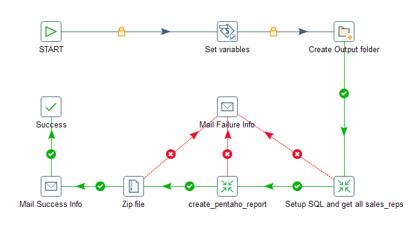

## Pattern-2: Batch PRD reports by Using Parameters ##

Using parameters is one of the most effective ways in Pentaho PDI to reuse
the same transformation or job on multiple instances with similar workflow. 

The core target of this task is to automate Pentaho reports using PDI job and transformations,
with parameters to set up different offices, providers and reseller affiliations etc.

The main steps include:
1. Load the configuration file (different offices have different configuration files) into the stream
2. Do some string REPLACEMENT to convert it into valid SQL
3. Run the SQL to retrieve a list of sales_reps
4. Run the `Pentaho Reporting Output` step for each sales_rep and the corresponding parameters

See below PDI job entries for the data flow:


**Note:**

+ Parameters (start_date, end_date, office, provider etc.) are specified on the
  command line and saved in environment variables in the PDI job JVM.

+ Configuration files are maintained externally with templates like __START_DATA__
__END_DATE__ which will be replaced by environment variables in the 
`Modified Java Script value` Step

```
SELECT 0 AS sales_rep_id, 'All' AS sales_rep

UNION ALL

SELECT DISTINCT u.id AS sales_rep_id
,      REPLACE(CONCAT(u.firstname, '_', u.lastname)," ","_") AS sales_rep_name
FROM   warehouse.loans f
JOUN   warehouse.users u ON u.id = f.sales_rep_id
WHERE f.loan_date <= '__END_DATE__'
AND f.provider = '__PROVIDER__'
AND f.id IN ( SELECT distinct r.loan_id
    FROM warehouse.repayment r 
    WHERE (f.loan_date >= '__START_DATE__' OR r.repayment_date >= '__START_DATE__')
    AND r.repayment_date <= '__END_DATE__' 
    AND u.office = '__OFFICE__'
)
```

### Job Entry: Setup SQL and get all sales_reps ###

The SQL configuration files are maintained externally and will be loaded 
with 'Load file content in memory' Step, see below:

```
  +-----------------------------+
  | Load file content in memory | 
  +-----------------------------+
                 |
                 |     +----------------------------+
                 +---> | Modified Java Script Value |
                       +----------------------------+
                                     |
                                     |     +------------------------+      +---------------------+
                                     +---> | Execute row SQL script | ---> | Copy rows to result |
                                           +------------------------+      +---------------------+

```

In the `Modified Java Script Value` step, replace the templates with the environment variables constructed from
the parameters.

```
var new_file_content = file_content.replace(/__START_DATE__/g, getEnvironmentVar("START_DATE"))
                                   .replace(/__END_DATE__/g, getEnvironmentVar("END_DATE"))  
                                   .replace(/__PROVIDER__/g, getEnvironmentVar("PROVIDER"))
                                   .replace(/__OFFICE__/g, getEnvironmentVar("OFFICE"));
```

The modified SQL will be feed into the `Execute row SQL script` to generate a list of rows
with id and name of qualified sales_reps. 


### Job Entry: create_pentaho_report ###
Read the result from the previous transformation, execute every input row so that each sales rep gets
his/her own report, and then use the standard `Copy rows to result` step to transfer rows of data to 
the next transformation.

```
  +----------------------+      +----------------------------+      +--------------------------+
  | Get rows from result | ---> | Modified Java Script Value | ---> | Pentaho Reporting Output |
  +----------------------+      +----------------------------+      +--------------------------+
```

In `Modified Java Script Value step`, we finalize all the parameters required to run the PRPT report including
the PRPT filename, output Excel filename, start_date, end_date, provider etc. and make sure their date types 
match the corresponding report parameters.
```
var prpt_filename = getEnvironmentVar("rpt_file");
var p_start_date = str2date(getEnvironmentVar("START_DATE"),"yyyy-MM-dd");
var p_end_date = str2date(getEnvironmentVar("END_DATE"),"yyyy-MM-dd");
var output_filename = getEnvironmentVar("output_dir") + "/" 
    + provider.getString() + '_'
    + date2str(p_start_date,"MMMyy") + "_" + reseller_name.getString()
    + ".xls";
var output_format = "table/excel;page-mode=flow";
var provider = getEnvironmentVar("PROVIDER");
var reseller_id = sales_rep_id.getNumber();
```

### bash script to batch all reports ###
Use a Linux TUI interface tool `dialog`, the Pentaho reports can be generated
directly on the command line, the files are grouped into providers and date ranges.
Below is the trimmed version of the script:

```
#!/bin/bash

EMAIL_TO=accounting@example.com
BASE_DIR=$PWD
LAST_MONTH=$(date -d'-1 month' +%Y-%m-01)

read -e -r -p"Please enter Report Month($LAST_MONTH): " tday
tday=${tday:-$LAST_MONTH}
date -d"$tday" >/dev/null 2>&1 || { echo "invalid month"; exit; }
tmonth=$(date -d"$tday" +%b%Y)

function generate_pentaho_report {
    /data/pentaho/data-integration/kitchen.sh               \
        -rep=my_rep                                         \
        -user=xicheng                                       \
        -pass="Encrypted 2f9d6b20f6aa7f2e48a14fd628fb6fccc" \
        -dir=/Accounting/                                   \
        -job=automate_prpt_report                           \
        -param:office=$1                                    \
        -param:sales_type=$2                                \
        -param:comm_type=$3                                 \
        -param:email_to="$EMAIL_TO"                         \
        -param:base_dir="$BASE_DIR"                         \
        -param:start_date="$(date -d"$tday" +%Y-%m-01)"     \
        -param:end_date="$(date -d"$tday +1 month -$(date -d"$tday" +%d)day" +%F)"\
        -param:report_month=$(date -d"$tday" +%m%y)
}

opt=$(dialog --title "Pentaho report - $tmonth"               \
             --menu "Please select a report:" 15 55 6         \
             1  "NewYork InHouse Upfront"                     \
             2  "NewYork InHouse Residuals"                   \
             # list skipped #
             12 "Exit from this menu"  2>&1 >/dev/tty)
             
case $opt in
  1)
    echo "NewYork InHouse Upfront"
    generate_pentaho_report newyork inhouse upfront
    echo "Completed: newyork InHouse Upfront"
    ;;
  2)
    echo "NewYork InHouse Residual"
    generate_pentaho_report newyork inhouse residual
    echo "Completed: NewYork InHouse Residual"
    ;;
#...below skipped#
  12)
    exit
    ;;
esac
```


