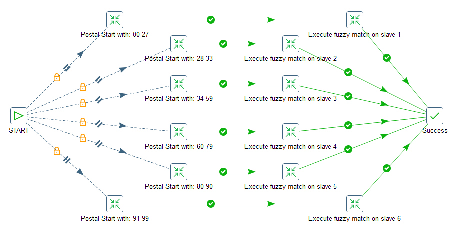

## Running Transformation Remotely ##

The Carte server is designed for Pentaho PDI jobs or transformations to run in a clustering 
environment. However, not every Pentaho transformation step supports Clustering, Fuzzy match 
is one of these steps. 

Since our task (data deduplication) can be split into independant sub-tasks. 
Using Pentaho Carte server's remote execution capability, we can split the dataset 
and then run them on different remote servers.

Below is a PDI job task used to split the data and then run them remotely at the same time:

Right-click the 'Start' entry and select "Run Next Entries in Parallel".

### Run Carte service ###
See documentation: [Setting up Carte service](https://wiki.pentaho.com/display/EAI/Carte+Configuration).
Check the folder `$PENTAHO_HOME/pwd` for sample configurations

### Setup clusters ###
On the left Panel -> `View` tab, select Transformations -> trnasormation_script_name 
                  -> Slave Servers -> in `Service` tab

Server name: slave-1
Hostname or IP address: (i.e. 192.168.10.101)
Port: (i.e. 8081)  <-- make sure firewall is open to your server on this port
* [ ] Is this master

**Note:** Only one master is allowed.

### Setup Run Configurations (Pentaho 7.0+) ###
On the left Panel -> `View` tab, select Transformations -> trnasormation_script_name -> Run Configurations
Right Click and select 'New...'

Engine: Pentaho
Setting: Slave server
Location: slave-1
* [x] Send resources to this server

By selecting `Send resources to this server`, all necessary kjb, ktr files will be uploaded to 
the remote server as a ZIP file under the /tmp folder (Linux box).

### Setup the remote server execution ###
On each of the job entries, i.e. "Execute fuzzy match on slave-3", double-click the icon.

+ From the `Options` tab, `Run configuration` dropdown, select `slave3`, one of which you defined
in `Setup Run Configurations`. This configuration can also be feed as a parameter from the command line.

+ From `Parameters` tab, add the parameter required to execute the transformation.

**Note:**

To make sure the transformation or job execute properly on the remote server, make sure the following
requirements meet:
+ If transformation/jobs were saved in repository, must have ~/.kettle/repositories.xml on all slaves
+ All servers must be able to connect to the database server with the same server IP and credentials
+ If any Steps/Entries read from or write to local data files, make sure the same path/files exist on the remote server

