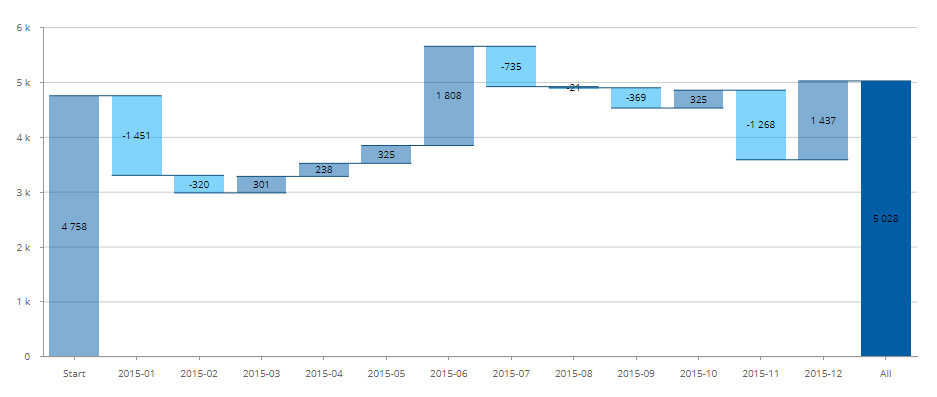
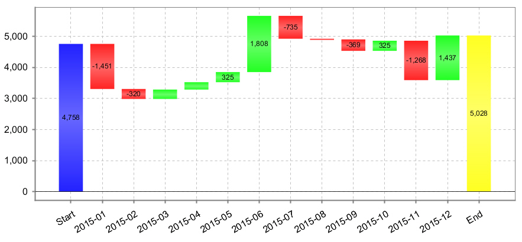

## Creating Waterfall chart ##

The waterfall chart is a good way to show the amount increment/decrement over a time period.
Below examples show waterfall charts generated by Pentaho toolset.

**With CDE (Community Dashbord Editer, Pentaho BA server 8.0):**


**With PRD (Pentaho report designer, CE 8.0):**


To make a waterfall chart, it's important to understand the format of the required data set.
There are 'Start' and 'End' points, both of which must be the absolute values of the amounts.
All the points in the middle are the amount difference between two adjacent points.

With Pentaho, we can prepare these dataset in different ways:

### Using MySQL User-defined Variables ###
The key is to cache loan_amount in the previous month. Using MySQL user-defined variables, 
we can save $prev_loan and use it in the next SELECT loop.

```
SELECT x.loan_month
,      CAST(x.delta_loan AS DECIMAL(12,2)) AS delta_loan
FROM (
    SELECT IF(@_prev_loan = 0, 'Start', b.loan_month) loan_month
    ,      b.amt_loan
    ,      b.amt_loan - @_prev_loan  AS delta_loan
    ,      (@_prev_loan := b.amt_loan) AS prev_loan
    FROM (SELECT @_prev_loan := 0) a 
    JOIN ( 
	SELECT CAST(LEFT(date_loan,7) AS CHAR) loan_month
	,      SUM(loan_amount) amt_loan
	FROM warehouse.loans
	WHERE date_loan >= ${ph_start_date}
	AND date_loan <= ${ph_end_date}
	GROUP BY 1
    ) b

    UNION ALL

    SELECT 'End', 0, @_prev_loan,0
) AS x
```
**Caveats:**

MySQL user-defined variables have a dynamic typing, you can not explicitly declare their data types, 
and the CAST() does not work all the time on these variables.

In the above SQL, the temporary table-x is to resolve a problem that 
MySQL forces the delta_loan as 'String' and using CAST( AS DECIMAL(12,2)) 
does not work directly.

### Using PDI as data source ###

PDI as data source can provide more flexibility than the PRD's query engine
+ `Table Input` step can take everything as parameters while in PRD, table
  names, keywords can not be parameterized, this makes something like order
  by <col-name> impossible (you can still order by <index-id> where index-id 
  aligned to the position in the SELECT list)
+ With PDI as data source, by default, you should not include multi-select parameters.
  Using some tricks in PRD, multi-select parameters are possible, but need
  to make sure escaping properly to avoid SQL parsing mistake or injection.

**Below is the Howto:**
```
    +-------------+      +----------------------------+
    | Table Input |----->| Modified Java Script Value | 
    +-------------+      +----------------------------+
                                       |                   +---------------+
                                       +-----------------> | Select values |
                                                           +---------------+
```
1. From main menu, Edit -> Settings... -> Parameters
   Add necessary parameters, in our example, add: ph_start_date, ph_end_date, p_country and p_product_type
   . Do set up default value so you can debug the transformation.

2. In the `Table Input` step, add the following SQL:
```
SELECT x.loan_month
,      x.amt_loan
FROM (
    SELECT IF(LEFT(date_loan,7) = LEFT('${ph_start_date}',7), 'Start',LEFT(date_loan,7)) loan_month
    ,      SUM(loan_amount) amt_loan
    FROM warehouse.loans
    WHERE date_loan >= '${ph_start_date}'
    AND date_loan <= '${ph_end_date}'
    GROUP BY 1
    ORDER BY NULL
) AS x

UNION ALL

SELECT 'End', 0 
```
**Note:** we want the first month to show as 'Start' and on the top, `GROUP BY` sorts the result by default 
and moves 'Start' to the end of the list, adding `ORDER BY NULL` will disable the sorting.

Select the following checkbox:
* [x] Replace variables in script?

3. Add `Modified Java Script Value` step with the following code:

```
var delta_loan = amt_loan - (prev_loan||0);
var prev_loan = amt_loan;
if (loan_month == 'End') {
    delta_loan = -delta_loan
}
```
At the last entry named 'End', delta_loan should be the actual amount(-delta_loan) since we
have the loan_amount set to zero at 'End'.

Click 'Get variables' button at the bottom and make sure the Fields added have proper types, i.e. "Number"  
with Length = 12 and Precision= 2

4. Add a `Select values` step
This step is optional, in case you want to enforce data types or rename certain fields.

5. Save the Ktr and run the transform to make sure it returns expected results.

**On the PRD end**

1. Add the ktr as a Resource:
   + From the main menu, select File -> Resources... -> Import 
   + Add the ktr script created above and name it for example 'get_amount'
   + Select `Content-type`: text/xml

2. Add ktr as the reporting data source:
   + From the main menu, select Data -> Add Datasource -> Pentaho Data Integration
   + Click the '+' button to add a new query
   + In the File box, enter the resouce name 'get_amount'
   + All 3 steps now should show in the `Steps` box, select 'Select values'
   + click 'Edit Parameter' to map parameters from PRD to PDI

3. Under the 'Data' tab of the main window, right click on the newly defined data source
   named 'Query-1' and then select 'Select Query'. now this data source will become the main
   data source. You can verify this from 'Structure' tab -> 'Attributes' tab -> 'query' section -> 'name' attribute

4. Drag the `chart` icon from the left-side toolbar onto 'Report Header', double-click 
   the chart and in the 'Edit Chart' dialogue, select 'Waterfall Chart(Image)'

5. Setup the following two major items:
   + category-column: the horizontal-axis --> loan_month
   + value-columns: the numbers for the vertical axis --> delta_amount
